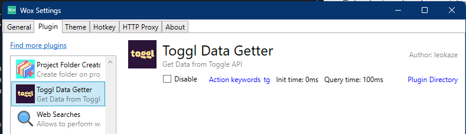
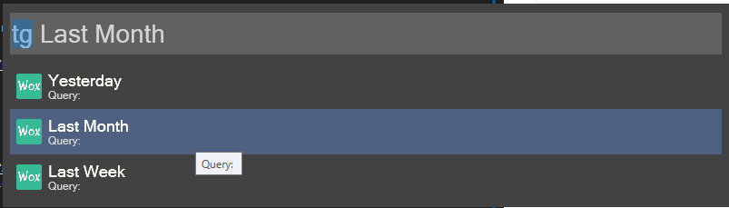
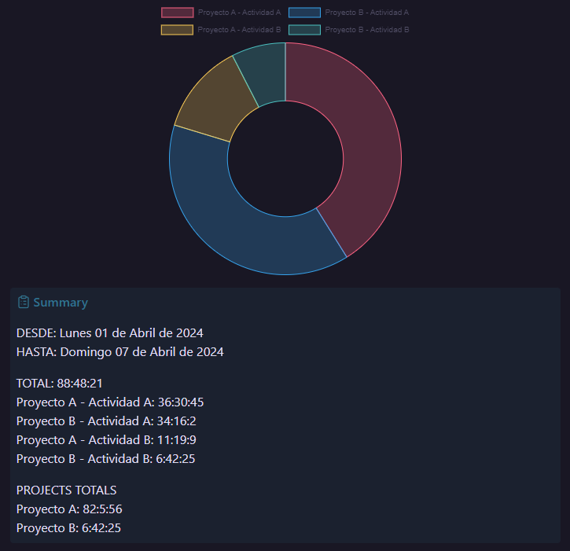

# Toggl To Obsidian Wox Plugin

Este plugin para [Wox](https://github.com/Wox-launcher/Wox) extrae los registros del tracking realizado con la aplicación de [Toggl](https://track.toggl.com/) utilizando la api de Toggl (no es necesario tener la aplicación de Toggl instalado) y los convierte en datos con formato markdown, los copia al portapapeles y los puedes pegar directamente en [Obsidian](https://obsidian.md/).

En Obsidian se puede utilizar el plugin [Charts](https://github.com/phibr0/obsidian-charts) para visualizar los datos extraidos.

## Instalación

Para instalar este plugin solo copia la carpeta "Toggl-Wox-Data-Getter" a la carpeta de plugins de WOX por lo general en: "C:\Users\USER_NAME\AppData\Local\Wox\app-VERSION\Plugins\". Habilita el plugin en las configuraciones y asígnale un atajo, en mi caso utilicé las letras "tg"



Es necesario tener [Python](https://www.python.org/downloads/) instalado, para el desarrollo de este script utilicé la versión de Python 3.12.2

### Módulos de python

Este script utiliza dos módulos extra:

- [pyperclip](https://pypi.org/project/pyperclip/) para copiar los datos generados al portapapeles.
```batch
pip install pyperclip
```

- [pytz](https://pypi.org/project/pytz/) para formatear las fechas y horas de registro a una zona horaria en específico, en mi caso La Paz, Bolivia.
```batch
pip install pytz
```

Instala estos dos módulos si no los tienes instalados ya.

## Configuración

Para acceder a tus datos solo son necesarios el email y el password de la cuenta de Toggl, estos debes ponerlos en el archivo Toggl.py en

```python
# Toggl.py
class Toggl():
    def __init__(self):
        # ...
        self.credentials = b'YOUR_EMAIL:YOUR_PASSWORD'
        self.time_zone = 'America/La_Paz'
        # ...
```

También puedes cambiar la zona horaria si así lo necesitas.

## Uso

En Wox después de poner las letras de acceso al plugin de toggl (en mi caso "tg") aparece un menú contextual de tres opciones:


- **Yesterday:** Una sumatoria de las entradas registradas el día anterior.
- **Last Month:** Una sumatoria de las entradas registradas el mes pasado.
- **Last Week:** Una sumatoria de las entradas registradas la semana pasada.

El resultado de escoger alguna de las opciones nos devuelven los datos en formato de markdown para obsidian y se ven de la siguiente manera:



Se puede observar que los datos recibidos se ordenan de mayor a menor y se agrupan por proyecto y actividad, también hace una sumatoria de cada proyecto y nos muestra la fecha en que se recopilaron esos datos.